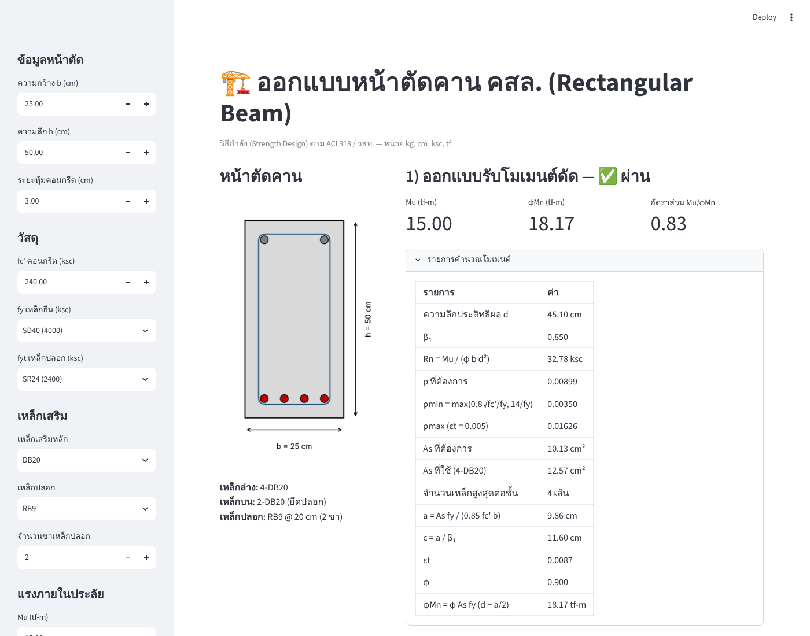

# ออกแบบหน้าตัดคาน คสล. (Streamlit)

โปรแกรม Streamlit สำหรับออกแบบหน้าตัดคานคอนกรีตเสริมเหล็กสี่เหลี่ยมผืนผ้า (เสริมเหล็กรับแรงดึงอย่างเดียว)
ด้วยวิธีกำลัง (Strength Design) ตาม ACI 318 / วสท. หน่วย kg, cm, ksc, tf



## ความสามารถ
- **โมเมนต์ดัด:** คำนวณ d, Rn, ρ ที่ต้องการ, ตรวจสอบ ρmin / ρmax, เลือกจำนวนเหล็ก, ตรวจจำนวนเหล็กต่อชั้น,
  ตรวจสอบ εt, φ และ φMn ของหน้าตัดที่เลือก
- **แรงเฉือน:** คำนวณ Vc, Vs ที่ต้องการ, ระยะเรียงเหล็กปลอก (รวมข้อกำหนด smax และ Av,min) และ φVn
- วาดรูปหน้าตัดพร้อมตำแหน่งเหล็กเสริม

## วิธีใช้งาน
```bash
pip install -r requirements.txt
streamlit run app.py
```

## ทดสอบ
```bash
pip install pytest
pytest
```

> โปรแกรมนี้ใช้เพื่อการศึกษาและออกแบบเบื้องต้น ผลการออกแบบควรได้รับการตรวจสอบโดยวิศวกรผู้มีใบอนุญาต
